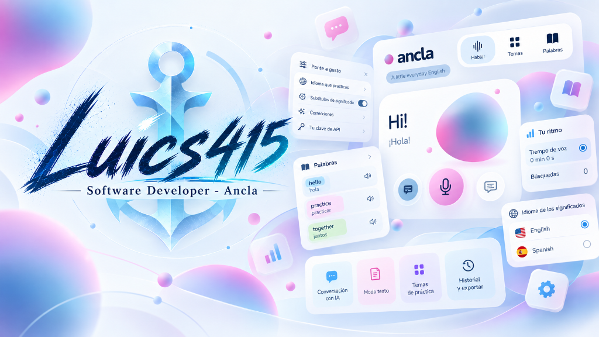
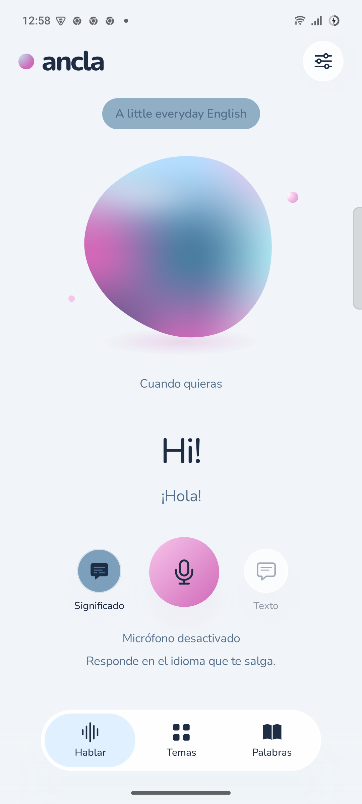
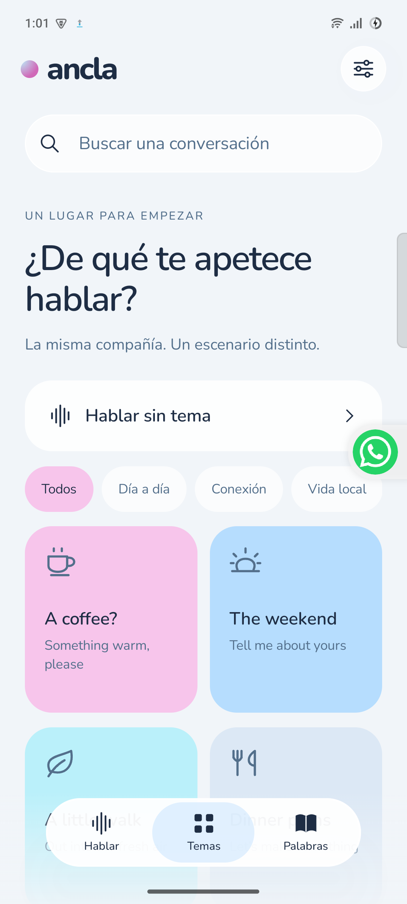
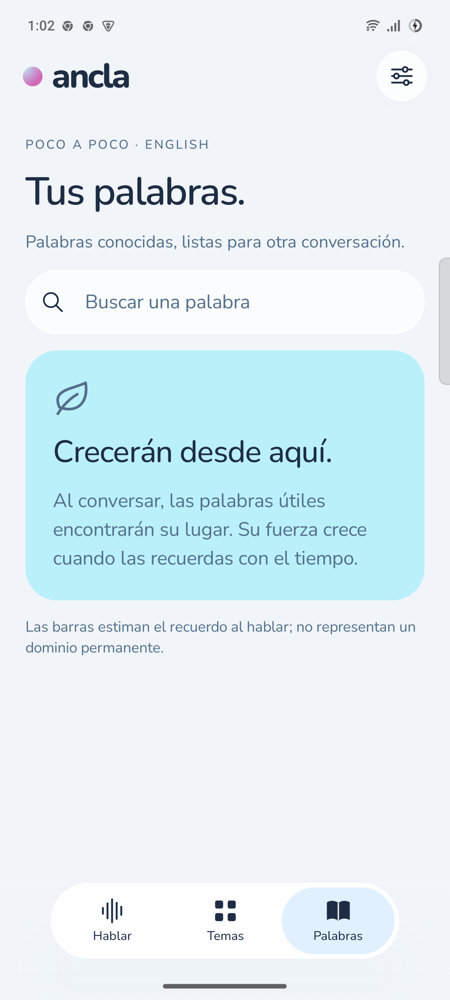
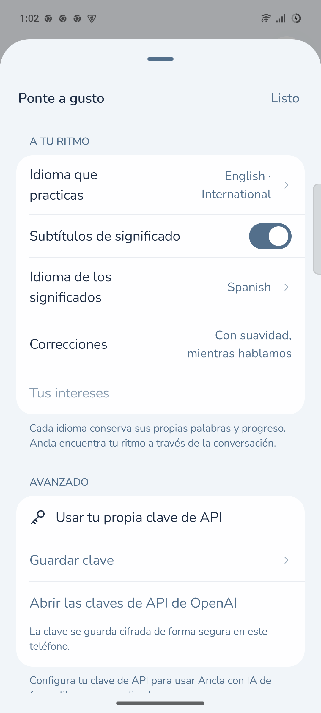
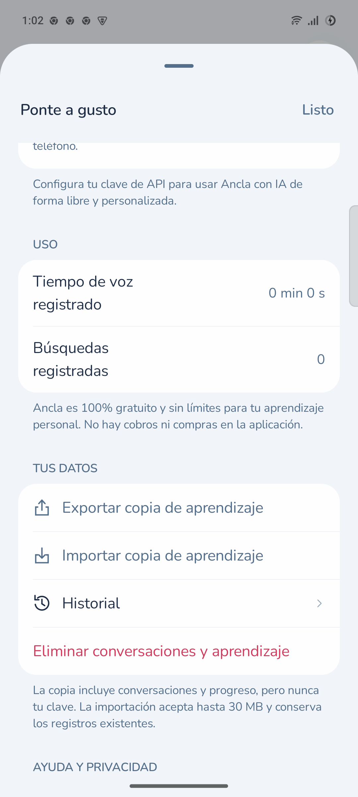
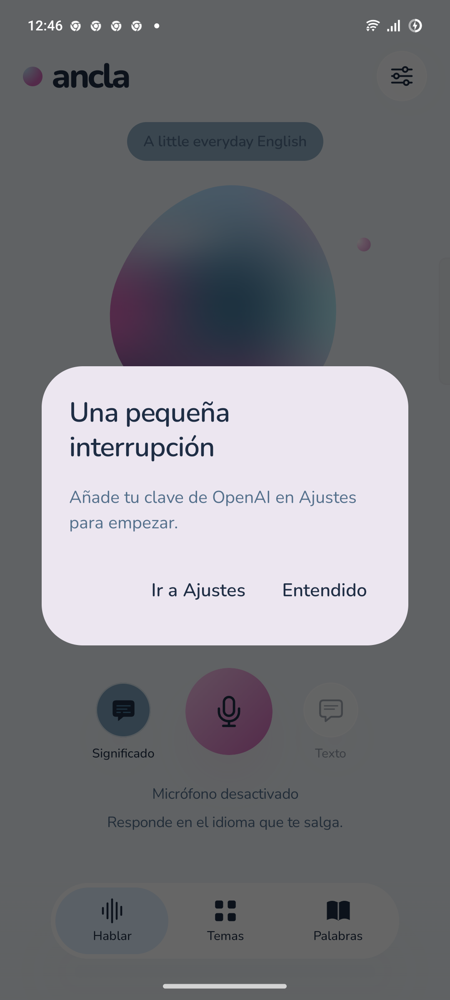
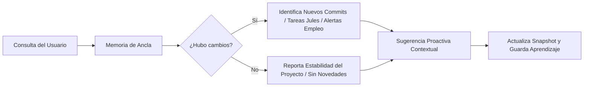
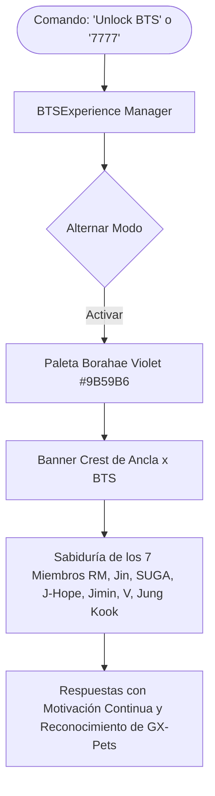

<p align="center">
  
</p>

# ⚓ Ancla

**Tu compañera conversacional para dominar idiomas con Inteligencia Artificial.**

> Desarrollado por **Luics415** · *Software Developer - Ancla*
> 
> **100% Gratuita, sin límites de minutos, sin suscripciones comerciales y con privacidad total en tu dispositivo.**

<p align="center">
  
  
  
  
</p>

---

## 🌟 ¿Qué es Ancla?

**Ancla** es una aplicación nativa para Android (con soporte complementario para iOS) diseñada para aprender y practicar idiomas a través de la conversación hablada natural. 

A diferencia de las aplicaciones tradicionales basadas en ejercicios mecánicos, Ancla te sumerge en un diálogo fluido con una compañera de IA pedagógica que te escucha, responde en tiempo real con voz natural, te brinda subtítulos de significado cuando tienes dudas y adapta el desafío a tu nivel.

---

## ✨ Características Principales

- **🔓 100% Libre y Sin Limitaciones:**
  - Sin minutos de prueba limitados ni muros de pago.
  - Sin publicidad ni necesidad de crear cuentas obligatorias.
  - Utiliza tu propia clave de API personal (OpenAI / modelos de IA), guardada de forma cifrada en tu dispositivo.

- **🎙️ Práctica Oral en Tiempo Real:**
  - Conversaciones de voz bidireccionales de baja latencia mediante WebRTC.
  - Orbe animado y reactivo con shader que refleja el estado de la conversación.
  - Modo mixto: puedes hablar por micrófono o escribir por texto si estás en un lugar ruidoso.

- **🎯 Pedagogía Conversacional Suave:**
  - La IA corrige como máximo un error lingüístico relevante por turno, de manera constructiva y sin cortar el ritmo de la conversación.
  - Respeta dialectos, estilos y tiempos de respuesta.

- **💬 Subtítulos de Significado:**
  - Subtítulos instantáneos y explicaciones contextuales de palabras difíciles sin salir de la conversación.

- **🗺️ Temas y Escenarios Situacionales:**
  - Más de 24 escenarios inmersivos (café, viajes, trabajo, fines de semana, etc.) adaptados culturalmente a cada idioma.
  - Búsqueda web integrada para debatir sobre noticias y temas del mundo real.

- **📚 Seguimiento de Vocabulario:**
  - Detección automática de nuevas palabras clave y frases aprendidas.
  - Indicadores de retención y memoria para repasarlas en sesiones posteriores.

- **🔒 Privacidad Garantizada:**
  - Todos los registros de aprendizaje, historial de conversaciones y vocabulario se guardan localmente en tu teléfono.
  - Cifrado seguro mediante **Android Keystore**.
  - Exportación e importación completa de copias de seguridad en formato JSON.

- **🎨 Diseño y Estética Arcane:**
  - Paleta visual refinada con degradados suaves (lavanda, cian etéreo, azul marino y fucsia).
  - Ícono artesanal de ancla en relieve y estilo frosted glass.

---

## 📸 Galería de Capturas (Android)

| 1. Pantalla Principal (Hablar) | 2. Temas y Escenarios | 3. Palabras y Retención |
| :---: | :---: | :---: |
|  |  |  |
| *Orbe animado y controles de voz* | *Situaciones prácticas de conversación* | *Vocabulario detectado y progreso* |

| 4. Configuración & Clave API | 5. Estadísticas de Uso Libre | 6. Inicio Rápido sin Clave |
| :---: | :---: | :---: |
|  |  |  |
| *Selección de idiomas y clave directa* | *Métricas de voz y búsquedas sin costo* | *Aviso directo para ingresar tu clave* |

---

## 🌍 Idiomas Soportados

Ancla cuenta con módulos específicos que incluyen objetivos pedagógicos, pronunciación, temas culturales y expresiones auténticas para:

1. **Inglés** (Internacional)
2. **Español** (España / Internacional)
3. **Francés** (Francia)
4. **Alemán** (Alemania)
5. **Italiano** (Italia)
6. **Portugués** (Brasil)
7. **Noruego** (Bokmål)
8. **Chino Mandarín** (Estándar / Pinyin)

---

## 🚀 Compilación e Instalación

### Requisitos Previos

- **Android Studio** (Koala / Ladybug / Quail o superior).
- **JDK 17** (Temurin, Corretto u OpenJDK).
- **Android SDK** con API 36 / 35.
- Dispositivo Android con depuración USB activada (o emulador con Android 8.0+).

### Instrucciones

1. **Clonar el repositorio:**
   ```bash
   git clone https://github.com/Luics415/mural.git
   cd mural/apps/android
   ```

2. **Compilar el APK de depuración:**
   - En Windows (PowerShell):
     ```powershell
     $env:JAVA_HOME = "C:\Program Files\Eclipse Adoptium\jdk-17.0.20.101-hotspot"
     .\gradlew.bat :app:assembleDebug
     ```
   - En macOS / Linux:
     ```bash
     ./gradlew :app:assembleDebug
     ```

3. **Instalar en tu dispositivo Android:**
   ```bash
   adb install -r app/build/outputs/apk/debug/app-debug.apk
   ```

4. **Configuración Inicial:**
   - Abre **Ancla** en tu teléfono.
   - Pulsa el ícono de **Ajustes** (arriba a la derecha).
   - En la sección **Avanzado > Usar tu propia clave de API**, pulsa **Guardar clave** e introduce tu clave de OpenAI.
   - ¡Listo! Pulsa el micrófono para iniciar tu primera sesión conversacional.

---

## ⚓ Ancla Developer Suite: Control de Proyectos, Jules, Workspace, Empleo & BTS Edition

Ancla cuenta con una **suite completa de asistencia y control técnico** integrada directamente en este entorno para administrar tus proyectos de GitHub, interactuar con **Google Jules**, supervisar tus cuentas de búsqueda de empleo y gestionar el ecosistema **Google Workspace**, todo potenciado con un **Motor de Memoria Dinámica** y la experiencia interactiva **BTS ARMY Edition (7777)**.

### 📊 Diagrama de Arquitectura Global

```mermaid
flowchart TD
    User([Usuario / Desarrollador]) -->|Comandos Naturales| AnclaCore[Ancla Core Orchestrator]

    subgraph GitHub_Jules [1. Proyectos de GitHub & Google Jules]
        AnclaCore --> GHManager[GitHub Manager]
        AnclaCore --> JulesBridge[Google Jules Bridge]
        GHManager --> GHRepos[(24 Repos Públicos Luics415)]
        GHManager --> GHStars[(16 Repositorios Favoritos)]
        JulesBridge --> JulesCLI[@google/jules CLI & Sessions]
    end

    subgraph Mobile_Job [2. Dispositivo Móvil & Monitor de Empleo]
        AnclaCore --> JobTracker[Job Tracker ADB Engine]
        JobTracker --> PhoneDevice[(Vivo V2314 por USB Debugging)]
        PhoneDevice --> Apps[LinkedIn, OCC, Computrabajo, Indeed, Glassdoor]
    end

    subgraph Google_Hub [3. Google Workspace & Ecosistema]
        AnclaCore --> GHub[Google Hub Services]
        GHub --> GSuite[Gmail, Calendar, Meet, Drive, NotebookLM, Analytics]
        GHub --> DeviceIntent[Lanzamiento Directo de Apps en Celular]
    end

    subgraph Memory_BTS [4. Memoria Dinámica & BTS Experience]
        AnclaCore --> MemoryEngine[Memory & Delta Engine]
        AnclaCore --> BTSEngine[BTS Experience: Unlock BTS / 7777]
        MemoryEngine --> AnclaMemory[(ancla_memory.json)]
        BTSEngine --> BorahaeAesthetic[Estética Púrpura, Sabiduría & Motivación]
    end

    AnclaCore --> ResponseDisplay([Reporte Inteligente en Chat / Terminal])
```

---

### 🧠 Ciclo de Aprendizaje Continuo y Detección de Deltas



---

### 💜 Experiencia Interactiva BTS ("Unlock BTS" / "7777")



---

### 🕹️ Comandos Disponibles de Ancla

| Comando | Acción Realizada |
| :--- | :--- |
| **`"Ancla, ¿cómo van mis proyectos?"`** | Escaneo en vivo de los 24 repos públicos de `Luics415`, favoritos, últimos commits y estado de Jules. |
| **`"Háblame de mi proyecto [nombre]"`** | Ficha detallada (QRVoxelStudio, Dev-Visualizer, AnchorGrid, etc.), commits, tareas de Jules y deltas de memoria. |
| **`"¿Qué proyectos están en Stars/Favoritos?"`** | Lista los 16 repositorios favoritos en tu GitHub con URLs y lenguajes. |
| **`"¿Cómo van mis cuentas de buscar empleo?"`** | Extrae en tiempo real eventos y notificaciones push desde tu teléfono conectado (`Vivo V2314`) para LinkedIn, OCC, Computrabajo, Indeed y Glassdoor. |
| **`"Revisa mis reuniones de Google Meet y agenda"`** | Muestra eventos del día con enlaces directos de Meet y sincronización de fuentes documentales con NotebookLM. |
| **`"Abre [gmail/drive/calendar/photos] en mi celular"`** | Lanza automáticamente la app en tu teléfono conectado vía ADB. |
| **`"Ancla, recuerda que [dato/preferencia]"`** | Guarda una nota o preferencia en su memoria persistente a largo plazo. |
| **`"Unlock BTS"` / `"7777"`** | **Easter Egg:** Activa/Desactiva la experiencia interactiva BTS ARMY Edition con estética Borahae y motivación técnica. |

---

## 🛠️ Tecnologías Utilizadas

- **Frontend:** Kotlin, Jetpack Compose, Material3, Coroutines, Flow.
- **Audio & Streaming:** WebRTC, AudioRecord, OpenSL/AAudio.
- **Seguridad:** Android Keystore, EncryptedSharedPreferences.
- **Networking:** OkHttp 4, Kotlinx Serialization.
- **IA:** OpenAI Realtime WebRTC API (`gpt-live-1`), Structured Outputs (`gpt-5.6-luna`), Search Tools.

---

## 📄 Licencia

Distribuido bajo la licencia MIT. Consulta el archivo [LICENSE](LICENSE) para más detalles.
